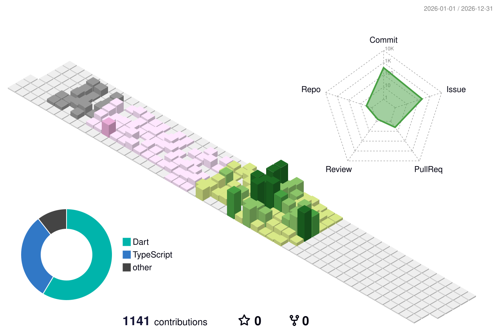

###  안녕하세요! / Hello there!

 

---

게임과 웹, 두 세계를 오가는 개발자입니다.  
Unity로 인터랙티브한 게임 경험을 만들고, Flutter와 Next.js로 사용자와 더 가까워지는 서비스를 만드는 것을 좋아합니다. 🎮✨

I'm a developer who bridges games and the web.  
I craft interactive Unity experiences and ship real-world services with Flutter & Next.js. 🎮✨

---

### 💡 Personal Stats

  
<b>Highlights / Proficiencies</b>

   

  **✨ Highlights**

  | Project | Description |
  |---------|-------------|
  | 🔐 [SecertBase](https://github.com/junans0boi/SecertBase) | 커플 전용 실시간 게임 플랫폼 — Flutter Web + Node.js + Socket.IO + Redis, 10가지 미니게임, [배포 중](https://secertbase.kro.kr) |
  | 🌐 [Omni Platform](https://github.com/junans0boi/omni-platform) | Discord/Slack 스타일 차세대 커뮤니케이션 플랫폼 — Next.js 15 · SSE 실시간 · LiveKit WebRTC · RBAC |
  | 🏫 [FourBlock](https://github.com/junans0boi/fourblock) | 인하공업전문대학 서버 구축·관리 웹 애플리케이션 |
  | 🎮 [서든어택 클론](https://github.com/junans0boi/Clone_SuddenAttack_Unity) | Unity로 구현한 FPS 게임 클론 — 메타버스 아카데미 1기 XR 과정 |
  | 🎯 UltimateMonstersFight / 테일즈러너 | Unity 게임 클론 2종 — 메타버스 아카데미 1기 XR 과정 |

   

  **🛠 Proficiencies**

  | Area | Skills |
  |------|--------|
  | 🎮 Game | Unity, C# |
  | 🌐 Web | Next.js, Vue.js, TypeScript, JavaScript |
  | 📱 Mobile / Cross-platform | Flutter, Dart |
  | ⚙️ Backend | Node.js, Express, Socket.IO, Redis, Prisma |
  | 🗄️ Database | MariaDB / MySQL, SQLite / PostgreSQL |
  | 🔧 Tools | Git, GitHub |

---

### 💪 Skills

**Game & Mobile**  

**Web & Full-stack**  

**Backend & Infra**  

**Tools**  

---

### 📊 GitHub Stats

  
  

---

